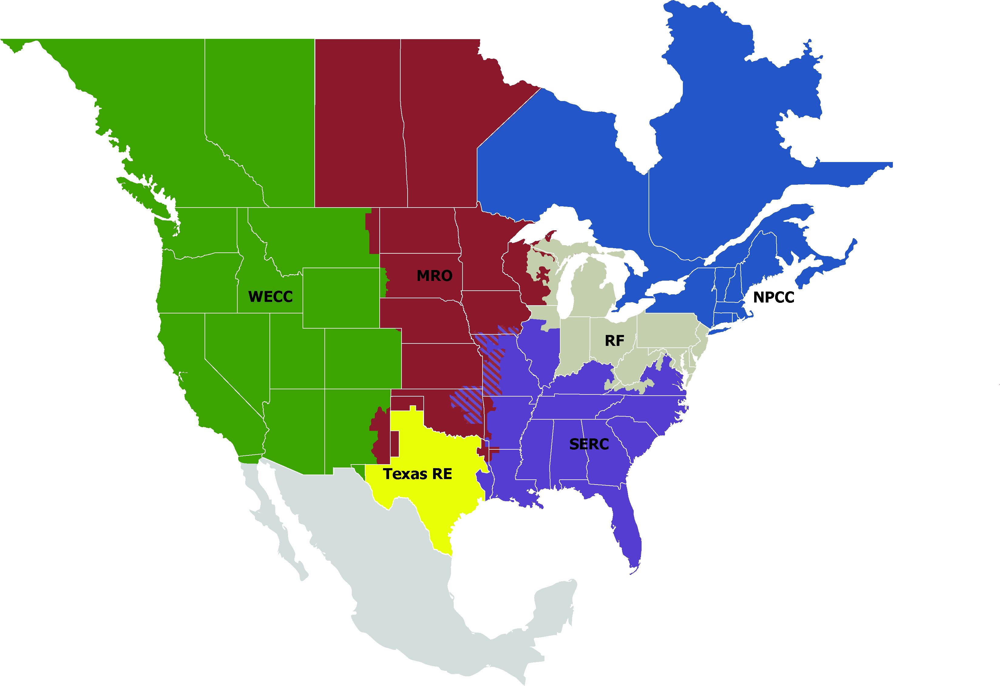

# Can Power Outages Predict Your Monthly Electricity Bill?

## **Introduction**

First and foremost, I would like to acknowledge that this dataset was collected by Purdue University, located [here](https://engineering.purdue.edu/LASCI/research-data/outages). It contains various pieces of information about the climate, electricity consumption patterns, and other pieces of useful information regarding the power outages across the United States between the years 2000-2016. The main point of this analysis is to take a look at how the world around us impacts our lives in ways we might not really think about. 

As a result, what makes this dataset and analysis very interesting is seeing whether we can predict the monthly price (per kilowatt-hour) of our electricity, given a variety of parameters, like state, outage start and end time, month, year, etc...

An important piece of information about this dataset: total number of rows = 1476, and total number of columns = 54. However, we won't be using all columns, so don't worry about having to understand each feature that is present in this dataset.

#### <u>Numerical Columns:</u> 

**- Year:** e.g. 2011, 2014.

**- Month:** e.g. January = 1 up to December = 12.

**- Outage Duration:** Duration of outage, in minutes.

**- Total Price:** Average monthly electricity price in the U.S. state (cents/kilowatt-hour).

**- Total Sales:** Total electricity consumption in the U.S. state (megawatt-hour).

**- Total Customers:** Annual number of total customers served in the U.S. state.

**- Anomaly Level:** This represents the oceanic El Niño/La Niña (ONI) index referring to the cold and warm episodes by season - essentially indicators for the environmental climate.

#### <u>Categorical Columns:</u>

**- US State:** The state in which the outage occurs.

**- Nerc Region:** Regions in North America created by "The North American Electric Reliability Corporation" that were involved in the outage event.

<figure>
  
  <figcaption align="center"><em>Map of the NERC Regions of North America.</em></figcaption>
</figure>

**- Climate Category:** This represents the climate episodes corresponding to the years. The categories—"Warm", "Cold" or "Normal" episodes of the climate are based on a threshold of ± 0.5 °C for the Oceanic Niño Index (ONI).

**- Cause Category:** Cause of the power outage event.

---

## **Data Cleaning**

To start, one thing I wanted to do was to do some feature engineering by combining the time of day and time of the year/month to make a proper outage start time and outage restoration time - each containing the year, month, day, hour, minute, and second of the outage start and end. 

### Imputation
In order to do this, I identified the missing values in the outage start and end dates, and chose to drop them from the dataset. This removed 9 rows from the 1476 starting amount, which was only 0.61% of the data, which is fine by me.

### Feature Engineering
From there, I combined the features `'OUTAGE.START.DATE'` and `'OUTAGE.START.TIME'` to make `'OUTAGE.START'`. 

I also combined `'OUTAGE.RESTORATION.DATE'` and `'OUTAGE.RESTORATION.TIME'` to make `'OUTAGE.RESTORED'`.

These two new features are added to my working list of features from the outages dataset to get a subset that looks something like this:


| U.S._STATE   | NERC.REGION   | CLIMATE.CATEGORY   | CAUSE.CATEGORY     |   YEAR |   MONTH |   OUTAGE.DURATION |   TOTAL.SALES |   TOTAL.CUSTOMERS |   ANOMALY.LEVEL | OUTAGE.START        | OUTAGE.RESTORED     |   TOTAL.PRICE |
|:-------------|:--------------|:-------------------|:-------------------|-------:|--------:|------------------:|--------------:|------------------:|----------------:|:--------------------|:--------------------|--------------:|
| Minnesota    | MRO           | normal             | severe weather     |   2011 |       7 |              3060 |       6562520 |       2.5957e+06  |            -0.3 | 2011-07-01 17:00:00 | 2011-07-03 20:00:00 |          9.28 |
| Minnesota    | MRO           | normal             | intentional attack |   2014 |       5 |                 1 |       5284231 |       2.64074e+06 |            -0.1 | 2014-05-11 18:38:00 | 2014-05-11 18:39:00 |          9.28 |
| Minnesota    | MRO           | cold               | severe weather     |   2010 |      10 |              3000 |       5222116 |       2.5869e+06  |            -1.5 | 2010-10-26 20:00:00 | 2010-10-28 22:00:00 |          8.15 |
| Minnesota    | MRO           | normal             | severe weather     |   2012 |       6 |              2550 |       5787064 |       2.60681e+06 |            -0.1 | 2012-06-19 04:30:00 | 2012-06-20 23:00:00 |          9.19 |
| Minnesota    | MRO           | warm               | severe weather     |   2015 |       7 |              1740 |       5970339 |       2.67353e+06 |             1.2 | 2015-07-18 02:00:00 | 2015-07-19 07:00:00 |         10.43 |

---

## **Exploratory Data Analysis**

To start, I decided to investigate the outage durations on a monthly and yearly basis. Below are tables containing the total number of minutes in outage duration from each month between 2000-2016:

Below is a table containing the **TOTAL duration of power outages on a "per month per year" basis (in hours)**:

|   Year |     Jan |    Feb |     Mar |    April |   May |     June |    July |     Aug |    Sept |     Oct |    Nov |   Dec | 
|-------:|--------:|--------:|--------:|-------:|-------:|--------:|--------:|--------:|--------:|--------:|-------:|--------:|
|   2000 |  234    |    0    |    1.17 |   0    | 243.33 |    1.1  |    0    |   82    |    0    |    0    |   0    |   54.4  |
|   2001 |   64.83 |    0    |   42.57 |   0    |   5.38 |  180.02 |    0    |    4.02 |    0    |    0    |   0    |    0    |
|   2002 |  455    |    0.78 |   60    |   0    |   0    |    0    |    0    |    9.43 |    0    |    0    | 184    |  399.35 |
|   2003 |   24    |   56.47 |    0    | 128.23 | 780.62 |   25.8  |  413.65 |  458.42 |  494.9  |  573.17 | 345.68 |  265.93 |
|   2004 |  367.35 |  109.02 |  298.95 | 108.17 | 688    |  274.27 | 1823.9  |  309.43 |  840.5  |  237.52 |  21    |   91.63 |
|   2005 |  795.83 |    0    |    4    | 240.13 |  25.5  |  456.27 |  274.58 |  812.17 | 1307.28 |  443    | 235.2  |  166.08 |
|   2006 |   53.05 |  545.53 |   39.5  |  95.42 |  13.37 |  101.45 |  665.45 |   12    |  165.5  |  591.77 | 258.58 | 1120.87 |
|   2007 |  186.5  |  187.68 |   11.5  | 172.63 | 162.95 |   14.38 |  293.65 |  307.03 |   59.88 |  137.87 |   0    |  568.92 |
|   2008 |  410.65 |  532.42 |   44.73 |  93.25 | 242.18 | 1026.67 |  531.38 |  738.1  | 3089.87 |   51    |  37.85 |  872.6  |
|   2009 | 1651.58 |  234.63 | 1388.8  | 219.83 | 178.2  |  438.22 |  137.95 |  159.53 |    0    |   76.27 |  15.75 |  196.9  |
|   2010 |  541.27 |  912.25 |  616.32 |  52.67 |  14.52 |  986.55 |  454.17 |  559.13 |  184.78 |  241.75 | 181.78 |  444.45 |
|   2011 |  347.85 |  608.18 |  645.08 | 615.43 | 743.87 |  330.02 |  602.35 | 2076.92 |  273.32 | 1462.47 |  42.57 |  329.15 |
|   2012 |   80.9  |   66.98 |  145.98 | 248.23 |  71.25 | 1165.87 |  762.47 |  167.35 |   58.47 | 2529.17 |  27.75 |   90.42 |
|   2013 |  158.88 |  229.08 |   36.02 | 158.87 | 232.58 |  393.08 |  271.63 |  108.05 |  103.33 |   38.32 | 512.13 | 1226.57 |
|   2014 | 2085.82 | 1901.15 |  808.42 | 257.55 | 111.3  |  221.85 |    0    |    0    |    0    |    0    |   0    |    0    |
|   2015 |   17.13 |   74.17 |   31.98 | 167.07 | 159.93 |  424.23 |  137.53 |  308.08 |    7.1  |   99.4  | 125.08 |  101.55 |
|   2016 |   35.3  |   35.37 |  941.55 | 106.57 | 446.98 |    0.28 |    0    |    0    |    0    |    0    |   0    |    0    |

Here is an additional table showing the **AVERAGE duration of power outages of each month (in hours)**:

|     Jan |    Feb |     Mar |    April |   May |     June |    July |     Aug |    Sept |     Oct |    Nov |   Dec |
|--------:|--------:|--------:|--------:|--------:|--------:|--------:|--------:|--------:|--------:|--------:|--------:|
| 56.4658 | 41.6191 | 54.4316 | 24.8977 | 34.6216 | 32.4734 | 38.5983 | 40.4746 | 71.5754 | 60.0156 | 28.8027 | 54.8965 |


And the **TOTAL duration of outages each year (in hours)**:

|   2000 |    2001 |    2002 |    2003 |    2004 |    2005 |    2006 |   2007 |   2008 |    2009 |    2010 |   2011 |    2012 |    2013 |    2014 |    2015 |    2016 |
|-------:|--------:|--------:|--------:|--------:|--------:|--------:|-------:|-------:|--------:|--------:|-------:|--------:|--------:|--------:|--------:|--------:|
|    616 | 296.817 | 1108.57 | 3566.87 | 5169.73 | 4760.05 | 3662.48 |   2103 | 7670.7 | 4697.67 | 5189.63 | 8077.2 | 5414.83 | 3468.55 | 5386.08 | 1653.27 | 1566.05 |

These tables allow us to examine trends in power outages across the entire dataset of U.S. power outages from 2000-2016, which constitutes our study population. For starters, I identified the year with the longest power outage durations to be 2011. This allowed me to focus on 2011 to see if I can identify any distributions or patterns in the data by looking at the largest sub-sample within my data.

Below is a histogram showing the distribution of power outages on a monthly basis - a similar collection of data as our tables from earlier, but this time a bit more visual.

 <iframe
    src="assets/htmls/hist.html"
    width"800"800"
    height="600"
    frameborder="0"
    
 >
 </iframe>
 <figcaption align="center"><em>Graph of monthly power outages in 2011</em></figcaption>

An interesting observation is that the distribution of outages in this visualization could possibly be normally distributed, or at least looks like it, with a peak reported number of outages in August of 2011.

Below is a choropleth map of the United States, visualizing the number of outages between the years of 2000 and 2016.

 <iframe
 src="assets/htmls/map.html"
 width"800"800"
 height="600"
 frameborder="0"
 ></iframe>
 <figcaption align="center"><em>Choropleth map of US power outages (2000-2016)</em></figcaption>

The goal of this visualization was to see if there were certain regions where outages were more common. As you can see, there **does not seem to be a clear focus of outages in certain NERC regions**, but there seems to be specifically a higher amount of outages in California, Texas, Michigan, and Washington.

---

## **Framing a Prediction Problem**

After spending a lot of time looking at outage durations, I was sure I wanted to focus on that as a predictor for whatever type of regression or classification problem I wanted to look at. At this point, I had developed a short list of ideas:


### Classification Ideas
- Predict the severity (in terms of number of customers, duration, or demand loss) of a major power outage: This is a multiclass classification problem, with options for the classes being:
    1. Heavy outage
    2. Medium outage
    3. Light outage

### Regression Ideas
- Predict the Oceanic Niño Index (ONI) -- or ANOMALY.LEVEL based on the number of customers, start/end date, etc...
- Predict the Average monthly electricity price in the U.S. state (`TOTAL.PRICE`)
 
 ---

Looking at the handful of options I created, I decided to focus on regression. Classification sounded very interesting, but with an interest in looking at the financial side of this dataset, I found myself more drawn to building a regression model. As a result, I chose to predict the average monthly electricity price in the U.S. state!

### Final Decision
Predict the Average monthly electricity price in the U.S. state (`TOTAL.PRICE`)

---

## **Baseline Model**

The first thing I wanted to do when building a model was to make sure I preprocess all of my data given in my dataset. This led me to working on a pipeline that preprocesses all of the info before feeding it into the regression model. Since my data contains both numerical, categorical, and `pd.Datetime` datatypes, I will need to make sure I build my pipeline in such a way that all of this data is handled properly.

As a refresher, here are the features that are each datatype:

#### Categorical
- `'U.S._STATE','NERC.REGION','CLIMATE.CATEGORY','CAUSE.CATEGORY'`

- **Special note:** all of the categorical features that I am using is nominal, meaning that there is no inherent order in the categories that I have listed

#### Numerical
- `'YEAR', 'MONTH','OUTAGE.DURATION','TOTAL.SALES','TOTAL.CUSTOMERS','ANOMALY.LEVEL'`

#### Datetime
- `'OUTAGE.START', 'OUTAGE.RESTORED'`

---

However, for my base model, I only wanted to use the categorical and numerical features to predict `'TOTAL.SALES'`. 

### Building the Preprocessing Pipeline

For my numerical pipeline, I decided to use sklearn's `SimpleImputer()` to fill in any missing values in my data by taking the mean and using that to fill values. Sklearn's `SimpleImputer()` does this by using univariate imputation, meaning it only uses the feature that the missing value is in to compute the mean, leading to a more complete dataset, but being susceptible to outliers. Additionally, I also added a `PolynomialFeatures()` transformer to help capture any non-linear relationships, which can help improve the model performance. I set the degree for the polynomial features to 2 as a start - it'll be a hyperparameter that I later tweak when I am testing different models.

This is what my numerical preprocessor looks like:

<iframe
 src="assets/htmls/numerical_preprocessing.html"
 width"800"700"
 height="150"
 frameborder="0"
 ></iframe>

For my categorical pipeline, I decided to use sklearn's `SimpleImputer()` here, too, but this time to fill missing values with the most frequent value of each feature. Again, because this is a univariate `SimpleImputer()`, it looks at each feature to fill the missing values with the most frequent value. I also used a `OneHotEncoder()` so my categorical data can be used by transforming each feature passed through my one hot encoder to become a series of binary columns -- essentially making the data able for the model to interpret. Some special settings I used was setting `drop=True`, which drops one category from each feature that is passed through to make sure collinearity doesn't occur (several datasets showing the same information). This works in a series of binary columns because when you drop one of them, that instance or "event" becomes implicitly true when for that row, all the other columns are set to "False" or "0". As a preventative measure, I also set `handle_unknown="ignore"`, which just transforms an unknown column to all zeros if the encoder doesn't know what it is given.

This is what my categorical preprocessor looks like:

<iframe
 src="assets/htmls/categorical_prepocessing.html"
 width="800"
 height="150"
 frameborder="0"
 ></iframe>

Combining the numerical and categorical preprocessor, inside a column transformer, this is what the finished baseline preprocessor looks like:

<iframe
 src="assets/htmls/baseline_preprocessing.html"
 width="800"
 height="175"
 frameborder="0"
 ></iframe>

### Building the Baseline Model

 From there, I built my baseline model using sklearn's Linear Regression model:
 <iframe
 src="assets/htmls/base_model.html"
 width="800"
 height="250"
 frameborder="0"
 ></iframe>

However, I wanted to go a bit further and tune the hyperparameter of the `PolynomialFeatures()` degree for my basemodel. I did this utilizing sklearn's `GridSearchCV()`, where I found that for my basemodel, a degree of 1 is actually the best, meaning that it essentially makes my model ignore the polynomialfeatures transformer, which I think is quite funny.

Below is a comparison of model performance using Mean Squared Error (MSE). A lower MSE indicates better predictive accuracy, with values closer to zero representing smaller average prediction errors. This metric was chosen because it penalizes larger errors more heavily, which is important when predicting electricity prices where significant deviations could have meaningful economic impacts:

| Models               |      MSE |
|:---------------------|---------:|
| Baseline Model       | 25.4768  |
| Tuned Baseline Model |  7.76278 |

At this point, I thought that my model was quite alright. I was trying to be mindful of how I engineered my data, was careful of my imputations, and felt that I had built a complex model that did its job well, and wasn't made complex just for the sake of having a large diagram. However, there were still some things I wanted to add to my model, and test, such as adding the Datetime features I built during the EDA in the beginning of this project. I also wanted to add some kind of regularization to combat any overfitting that may occur with my polynomial features transformer.

---

## **Final Model**

That leads to the work I spent making my final model. Here, my goals for attempting to improve my base model were quite simple:
1. Incorporate the Datetime features, `'OUTAGE.START'` and `'OUTAGE.RESTORED'`
2. Add Regularization to reduce overfitting
3. Tune the model after making these changes

In selecting the optimal approach, I considered various regression models including SVM and Random Forest. Due to computational constraints, I narrowed my focus to Linear Regression and Lasso (detailed in Appendix A).

### Building the New Preprocessing Pipeline

To make my final model better, I first need to go back to my preprocessing pipeline from before and add a datetime preprocessor to it.

For my datetime preprocessor, I spent a lot of time thinking of unique features I could engineer from knowing the exact date and time of an outage starting and ending. Below are some of the ideas I thought of:   

- **Basic Temporal Features:** Building features for the day, month, hour, day of week (like Monday or Wednesday), or fiscal quarter.

- **Basic Business Context:** Building binary features that check if the outages start on a weekend, or during business hours.

- **Different Times of Day:** Required splitting up the 24 hours of a day as morning, afternoon, evening, and night, and seeing when an outage starts according to that (Binary Feature).

- **Peak Demand Hours:** Checking if an outage starts during business peak demand hours, which I labeled as being between 4-8pm.

- **Seasonal Indicators:** Splitting the months into different seasons, and checking when an outage starts according to that.

Ultimately, I built a function transformer that does all of this, and returns a dataframe containing all of this information. The reason I used all of them in particular was because in regards to predicting the average monthly electricity price in the U.S. state, binary features such as the different times of day and peak demand hours make it easier to create opportunities to draw patterns in the data, like realizing that if outages seem to start during business hours or mainly during weekdays, then prices will be lower since businesses will not pay a lot for electricity that isn't consistent. This sentiment continues for all of the business context, but also for the times of day, seasonal indicators, and basic temporal features. 

Continuing, I also included a simple imputer to this pipeline that fills missing values with the mean. This was purposefully placed after the function transformer so that it could fill any possible missing values before the dataframe's information was passed into the actual regression function in the second part of the pipeline.

This is what my Datetime preprocessor looks like:

<iframe
 src="assets/htmls/datetime_preprocessing.html"
 width="800"
 height="150"
 frameborder="0"
 ></iframe>

 As a result, my new final preprocessing function (including this new Datetime processor) looks like this:
 
<iframe
 src="assets/htmls/final_preprocessing.html"
 width="800"
 height="210"
 frameborder="0"
 ></iframe>

### Testing Models

Before utilizing the new processing pipeline, I wanted to make a lasso pipeline to regularize the model with just the numerical and categorical preprocessor. Below is what this model looks like:

<iframe
 src="assets/htmls/lasso_pipe.html"
 width="800"
 height="250"
 frameborder="0"
 ></iframe>

Tuning this lasso pipeline yields the following values for our hyperparameters:
- Alpha value of 0.1
- Polynomial degree of 2 

| Models               |      MSE |
|:---------------------|---------:|
| Lasso Model          |  5.75579 |
| Tuned Lasso Model    |  4.07871 |


However, we still have to build our final model, which is our preprocessing 2.0 pipeline (including the Datetime pipeline), and a Lasso regression model:

<iframe
 src="assets/htmls/final_model_pipe.html"
 width="800"
 height="290"
 frameborder="0"
 ></iframe>

Tuning our final model yields:
- Alpha value of 0.1
- Polynomial degree of 2
 
With our newly tuned final model, we can add it to our list of models and their respective mean squared errors to evaluate the performance of each one!

| Models               |      MSE |
|:---------------------|---------:|
| Baseline Model       | 25.4768  |
| Tuned Baseline Model |  7.76278 |
| Lasso Model          |  5.75579 |
| Tuned Lasso Model    |  4.07871 |
| Final Model          |  5.75579 |
| Tuned Final Model    |  4.05668 |

Looking at the table above, we can look at various patterns within our models. For starters, we can see the importance of tuning the hyperparameters for each model based on how much the MSE differs from each base and tuned version of each model.

More importantly we can look at each tuned version of the models we've built to see just how much the final model differs (in terms of performance) from the baseline version.

Based on the MSE alone, we can tell that the final model is better than the baseline. By utilizing our engineered features `'OUTAGE.START'` and `'OUTAGE.RESTORED'`, we were able to extract various additional features that we were able to feed into our model. In addition to this, we also used `Lasso()` regression in combination with `PolynomialFeatures()` to not only look to see if we can find any non-linear trends in our data, but also make sure we don't overfit our model, using regularization. Combining all of this work, we were able to build a detailed final model!

---

## **Conclusion**

This analysis demonstrates that power outage data can indeed contribute to predicting monthly electricity prices. Through progressive model refinement from our baseline to the final regularized model incorporating temporal features, we achieved a significant reduction in prediction error, with MSE improving from 25.48 to 4.06.

The most substantial improvements came from:
1. Proper hyperparameter tuning
2. Applying Lasso regularization to prevent overfitting
3. Adding engineered datetime features, though with modest gains

These findings suggest that while power outage patterns do correlate with electricity pricing, the relationship may be less pronounced than initially hypothesized. Future work could explore additional external factors such as fuel costs, regulatory changes, and infrastructure investments that might provide stronger predictive signals.

In practice, this model could help utilities and consumers anticipate price fluctuations based on outage patterns, potentially informing energy policy and infrastructure investment decisions.

---

## **Appendix A: Alternative Models Considered**

I originally planned to test various other models beyond just Linear Regression and Lasso, such as `SVM` and `random_forest`. I had written some hyperparameters I wanted to test, but they were computationally very expensive, and made it nearly impossible to run the tests with my machine. This caused me to remove them from my scope of models and methods I would test to make my final model.

Below are the tests that I was planning to run:
```py
from sklearn.linear_model import LinearRegression
from sklearn.svm import SVR
from sklearn.ensemble import RandomForestRegressor
from sklearn.model_selection import GridSearchCV
from sklearn.linear_model import Lasso

model_params = {
    'svm': {
        'model': SVR(gamma='auto'),
        'params': {
            'model__C': [1,10,20],
            'model__kernel': ['rbf','linear']
        }
    },
    'random_forest': {
        'model': RandomForestRegressor(random_state=42),
        'params': {
            'model__n_estimators': [1,5,10]
        }
    },
    'lasso': {
        'model': Lasso(max_iter=10000, tol=0.001,random_state=42),
        'params': {
            'model__alpha': [0,0.5,1,10]
        }
    }
}


scores = []

for model_name, mp in model_params.items():
    pipe = Pipeline(
        steps=[
            ('preprocessing',preprocessing),
            ("model",mp['model'])  
        ]
    )
    reg = GridSearchCV(pipe,mp['params'], cv=5,return_train_score=False,n_jobs=-1,verbose=10)
    reg.fit(X_train,y_train)
    scores.append({
        'model': model_name,
        'best_score': reg.best_score_,
        'beset_params': reg.best_params
    })

df = pd.DataFrame(scores,columns=['model','best_score','best_params'])
```
From there, I was planning to look at the dataframe and see which model had the best score using the score method from GridSearchCV, but again, this was computationally too hard to run on my computer, so it had to be scrapped.

Perhaps in the future, with more time, and learning a bit of `CUDA` or other Python modules that help split the workload onto a computer's GPU and multiple processors, I'll come back to incorporate this into my final model decision.

## **Extra Notes**

One note I made when evaluating each model was comparing the MSEs of the <ins>Tuned Lasso Model</ins> with the <ins>Tuned Final Model</ins>. I noticed that according to my choice of performance evaluation, the tuned final model was only the *slightest* bit better than the lasso model that didn't have the Datetime features preprocessor as well. 

In particular, the addition of the DateTime preprocessor only decreased the MSE by 0.02203, which doesn't feel like a lot. This makes me think that the information extracted from the DateTime preprocessor wasn't that useful for predicting `'TOTAL.PRICE'`.

Additionally, the tuned lasso and tuned final model both had the exact same hyperparameters. One thing I would like to do in the future would be to run more extensive tests on the alpha hyperparameter in lasso regression, since 0.1 was the smallest I had, with the followup value being 1 and then 10. 

Overall, while this work was very fun and intriguing, I wish to be able to revisit it again with more depth to my testing. Running into computational limits when using `GridSearchCV()` was very frustrating, and limited my testing quite a bit.